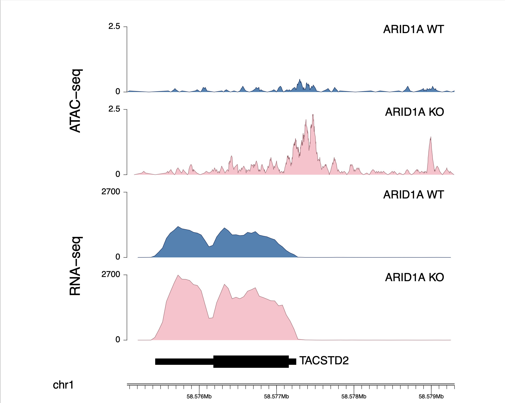

# ARID1A KO vs WT Multi-omics Analysis in HR+/HER2− Breast Cancer

This repository contains the source code used to analyze **ATAC-seq** and **RNA-seq** data comparing **ARID1A knockout (KO)** and **wild-type (WT)** conditions in **HR+/HER2− breast cancer**.

The analyses in this repository were used to generate results for the **SABCS 2024** abstract:

> **PS13-08: ARID1A as a Novel Regulator of Trop2-ADC Efficacy in Trop2-Low Hormone Receptor–Positive Breast Cancer**

The work was presented in the **Highlighted Abstract: Spotlight on CDK 4/6i & ADCs** session.

## Abstract

- **AACR/SABCS Abstract:** https://aacrjournals.org/clincancerres/article/31/12_Supplement/PS13-08/753298/Abstract-PS13-08-ARID1A-as-a-Novel-Regulator-of
- **Presentation Video (YouTube):** https://youtu.be/GYowpc1F0K0?si=U7qD84IC0TPopCll

---

## Repository Contents

This repository includes scripts and workflows for:

- RNA-seq data processing and analysis
- ATAC-seq data processing and analysis
- Differential expression analysis
- Chromatin accessibility analysis
- Data visualization
- Figure generation for the SABCS 2024 presentation

---

## Presentation Figures

### Figure 1. BigWig Visualization

---

### Figure 2/3. Correlation between ARID1A and Trop2 and Trop2 Expression

 
 

---

## Citation

If you use this repository or its analyses, please cite the following abstract:

> **PS13-08: ARID1A as a Novel Regulator of Trop2-ADC Efficacy in Trop2-Low Hormone Receptor–Positive Breast Cancer.**  
> Presented at the San Antonio Breast Cancer Symposium (SABCS) 2024.

---

## Contact

For questions regarding the analyses or this repository, please open an issue or contact the repository owner.
